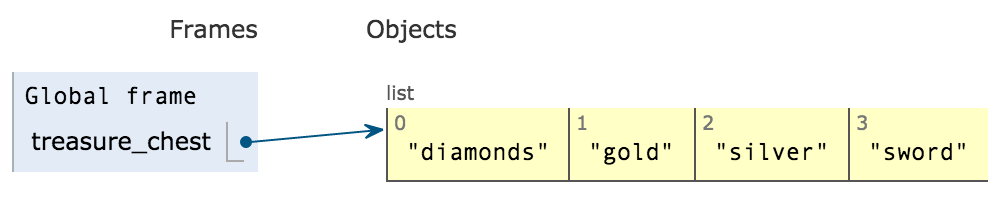
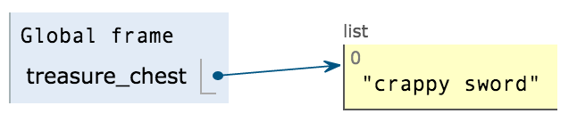
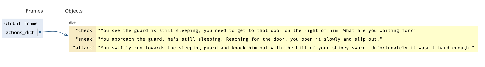
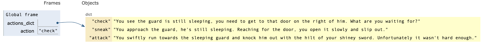
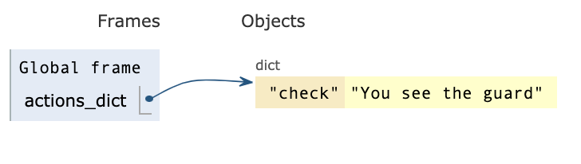
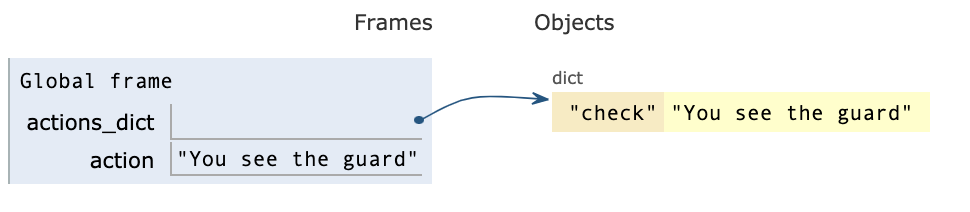

.. _beginners-python-text-based-adventure:

==================================================
Learn Python by making a text-based adventure game
==================================================

Introduction
------------

#. Setting up uv.

    For MacOS, Linux and Windows instructions, please visit the following page for instructions to install uv: https://docs.astral.sh/uv/getting-started/installation/

#. Setting up Python

    Using `uv` to set up Python. Type the following, and hit Return(⮐)::

        uv python install 3.14

    You should be able to run Python version 3.14 by typing the following, and hit Return(⮐)::

        python3.14
    
    and see it automatically return a message similar to the following::

        Python 3.14.2 (main, Dec  9 2025, 19:29:30) [Clang 21.1.4 ] on darwin
        Type "help", "copyright", "credits" or "license" for more information.
        >>>

    ℹ️ Reference: https://docs.astral.sh/uv/guides/install-python/

#. Editors

    - Visual Studio Code (Recommended): https://code.visualstudio.com/

    **Note**: If you are using Visual Studio Code we recommend `disabling Copilot features <https://code.visualstudio.com/updates/v1_104#_hide-and-disable-github-copilot-ai-features>`__ for the duration of this workshop:

    #. Go to `chat.disableAIFeatures <vscode://settings/chat.disableAIFeatures>`__
    #. Check the box to disable

    To re-enable later got back to the setting and uncheck the box.

#. You can download the code from https://github.com/codinggrace/text_based_adventure_game
   and move the zip file to your Desktop directory, and unzip it.

    .. image:: download_source.png

#. Open terminal in VS Code: Terminal > New Terminal

#. In the terminal window, type: ``uv sync``.

#. Close the terminal window.

#. Open new terminal window again in VS Code: Terminal > New Terminal (The reason is so the virtual environment is picked up.)

#. In the terminal window type ``python``. Note ``>>>``, this means you
   are in the "Python interpretor".

#. Type ``print("hello")`` and hit Return.

   You have just ran your first Python script by telling Python to print
   the text "hello".

   ``print()`` is an instruction to Python to print some text and
   display it on your terminal/cmd, and it's there by default when you
   install Python.

#. Type ``exit()`` to get out of "Python interpretor". You are now back
   in command line. You don't see ``>>>`` anymore.

#. Open Code Editor

   -  File > New File
   -  File > Save As...

      -  myfirstscript.py

   -  Type on first line ``print("hello, this is my first script")``
   -  File > Save

#. Go to terminal/cmd, and type ``python myfirstscript.py`` and hit
   Return.

   You just ran your first Python script via command line.

#. Now open "game\_01.py".

game\_01.py
-----------

In game_01.py, we encounter ``say_hello()``, this is called a function. We will cover this in a couple of sections.

Try running the script by ``python game_01.py`` and see what happens.

**Run the script.**

Other things to do with strings.
~~~~~~~~~~~~~~~~~~~~~~~~~~~~~~~~

``"Hello!"`` is a string. A string is a data type in Python.

``'`` (Single quotes) are the same as ``"`` (double quotes).

When you open with ``"`` you have to close with a closing ``"``, same
thing with ``'``.

Ask class to try the following:

``print("Hello!')``

``print('Hello!")``

``print('I'm going outside')``

Numbers
~~~~~~~

You can also print numbers. Numbers are of datatype integers, whole numbers.

``print(1)``

``print(246)``

String concatenation
~~~~~~~~~~~~~~~~~~~~

You can combine strings together, this is called concatenation.

``print("hello" + " world" )``

Try mixing numbers and strings, and see what happens in your Python interpretor.

``print("hello" + 123)``

Try the following and see what happens though:

``print(1 + 123)``

``1 + 123``

Now we have a calculator.

``+ - / *`` are addition, subtraction, division and multiplication
respectively.

Notice what happens when you do the following:

``5/2``

Now try:

``5//2``

What happened to the remainder? To get the remainder

``5%2``

What about decimals?

Numbers like ``1`` are called integers, they are whole numbers. For
decimals, they are known as floats.

Wondering what the ``if __name__ == '__main__':`` means.

It means that the Python script is also a standalone programme which makes it re-usuable. Just take it for now that normally this is the first thing you type. Your code editor, when you have it set to recognise *python* syntax, has a shortcut... try typing "if " and hit TAB key. It will autocomplete for you.

We will see an example how we re-use Python scripts, otherwise known as *modules* at the end of the workshop if we have time. 

Let's open "game_02.py", and start making a simple text-based adventure game.

game\_02.py
-----------

We are going to use another Python function called ``input()``. When
this is called, it will wait for the user to type something and hit
Return. This comes by default in Python.

``print(input("What's your name? > "))``

When you run this script, it will ask for your name, after you type and
hit Return, it will print out what you typed in.

Now for a bit of typing in game\_02.py
~~~~~~~~~~~~~~~~~~~~~~~~~~~~~~~~~~~~~~

We are going to introduce *comments*.

In game\_02.py, type ``#`` in front of
``print(input("What's your name? > "))``.

It will look like the following:

``# print(input("What's your name? > "))``

When you run the script, Python will load it and when it comes across
``#``, it will ignore that line of code.

Let's modified the code some more
~~~~~~~~~~~~~~~~~~~~~~~~~~~~~~~~~

Type the following after the commented out line:

``player_name =  input("What's your name? >")``

This will wait for player to type in their name, when they hit Return,
it will be saved to ``player_name``.

``player_name`` is known as **a variable**, it's somewhere for the computer to store objects
like strings and numbers.

**Save the file and run it in terminal/cmd.**

If you run the script now in terminal/cmd, nothing would happen as all
you did was store whatever the player typed in, and only last as long as
the script is still running. When it finishes, that variable won't exist
anymore.

Next line in script, type:

``print(player_name)``

**Save the file and run it in terminal/cmd, and see what happens.**

We are going to do some string formatting, this is recommended on offical Python.org docs.
~~~~~~~~~~~~~~~~~~~~~~~~~~~~~~~~~~~~~~~~~~~~~~~~~~~~~~~~~~~~~~~~~~~~~~~~~~~~~~~~~~~~~~~~~~

Change

``print(player_name)``

to

``print(f"Your name is {player_name}")``

Explanation:

``f"Your name is {player_name}"`` is a string. Python treats string (and everything else) as an object, and Python provides many features and in-built
functions associated with each type of object.

The **f** just before **"** is called `f-strings <https://www.python.org/dev/peps/pep-0498/>`_ which came into Python in version 3.6. So anything versions of Python prior to this version is not supported.

**👉 Try:**

    ``what = "knight"``

    ``print(f"Your name is {player_name}. You are a {knight}.")``

**Save the file and run it in terminal/cmd, and see what happens.**

Switch to terminal/cmd, and launch into Python interpreter, remember ``>>>``.

You can do this in the Python interpreter as well.

Example of showing what in-built goodies that come with a string object:-

    >>> dir(hello)

**👉 Try:**

    >>> player_name = "Grace"
    >>> what = "knight"
    >>> f"Hello, {player_name}"
    >>> f"Hello, {player_name}. You are a {what}.")

String Manipulations
~~~~~~~~~~~~~~~~~~~~
Let's change your name string to uppercase, go to your Python interpretor (you should see ``>>>``):

**👉 Try:**

Type and hit return:

    >>> player_name.upper()
    >>> f"Your name is {player_name.upper()}. You are a {what}."

Exit the Python interpreter by typing ``exit()`` and hitting RETURN.

Check **game\_02_comments.py** comments, has references to read up more about String Manipulations.

Functions
~~~~~~~~~
We mentioned *a function* earlier.

They are a name given to a routine which can return a value, and can be called many times. Functions will keep the script tidy.

To create a function, it begins with ``def`` followed by name of your function. 

It should start with alphabetical characters only, try adding a number in front of main() and run it again. You should be a syntax error.

**Save the file and run it in terminal/cmd, and see what happens.**

Remove the number in front of the function name.

**Save the file and run it in terminal/cmd, and see what happens.**

game\_03.py
-----------
Re-cap:

- main() to start the game
- Ask the player for their name, and print it out.

But we need to do something with the player.

**Run game\03.py**

**start_adventure()** will start our adventure in the game after getting player's name.

- Encounter 2 doors, red and blue.
- script will ask player to pick a door.

if statement
~~~~~~~~~~~~
The **if statement** is a data structure. We will see more data structures later.

For now, **if statements** are used for comparisons which is show with ``==``. In this instance, if the input by the player is:-

* *red*: Prints out the statement about the red door
* *blue*: Prints out the statement about the blue door
* Anything else that is NOT *red*/*blue*, it will print out a statement that you have to pick *red* or *blue* as an answer.

game\_04.py
-----------
Now we have a premise, let's add some more code. 

Find the line: ``if door_picked == "red":``. A function is created to call **red_door_room()**.

Find the line: ``elif door_picked == "blue":``. A function is created to call **blue_door_room()**.

Blue door
~~~~~~~~~
We just print out some statements to say that nothing happens.

Note the ``return`` call. This is an in-built Python function.

This ``return`` goes back to where it was called from, in this case, it's **start_adventure()** (line 34).

Red door
~~~~~~~~
When someone picks on the **red door**, we encounter a great red dragon. 

We ask the player what they want to do next with **raw_input()** and the input from the player is saved to a variable **next_move**.

The options are:

* Player types **flee**, they are back in the room with red and blue doors (previous room)
* Game Over.

Notice the **if statement**, it's different from **game\04.py**. We used **==** as comparisons, in this instance, we see if **flee** is in the text entered by the player.

**Run game\04.py**

[NOTE] Notice any problem with this method of checking if user typed **flee**? (Hint: try a word that has **flee** in it when you run the script.)

game\05.py
----------
In this script, create a function that can be called and passing in an argument. This is where you tell the player that they died giving a reason if they selected not to **flee**.

Following is a function with an argument passed in: ``you_died("It eats you. Well, that was tasty!")``

* you_died - **a function**
* Inside **()** in between double quotes - **a string**

you_died function
~~~~~~~~~~~~~~~~~
In the you_died() at the top, the string is passed to it and is assigned to a variable **why**.

You can use string formatting as before with the **why** variable.

``exit(0)`` - exit the program without errors

**exit()** is handy to end a program immediately.

**Run game\05.py**

game\_06.py
-----------
We will have a look at lists and see what happens in the **blue room**. In other languages, it can also be know as arrays.

Lists is basicially a list of items in sequential order. Can describe using the following image below:-

In game\06.py, we have a treasure chest containing *diamonds, gold, silver, sword* and a sleeping guard in front of a door. We ask what the player wants to do next.

We set up the if statement to print out the two options.

* Prints out what's in the treasure chest
* Decide on checking out the guard and the door

We will do more with lists in the next part.

game\_07.py
-----------
We want to do something with the treasure chest. Not doing anything with the guard/door just yet.

We will be looking more at lists and introduce the for loop.

After asking the player what they want to do, the **if statement** is another way of matching with user input.

Re-cap, we used:

* ``if door_picked == "red":``
* ``if "flee" in next_move:``

Now we are matching to see if the string the player types is in the list of strings.

``if action.lower() in ["treasure", "chest", "left"]:``

Notice **lower()**, handy to change to lowercase and match it with given list of strings.

If it matches, we print treasure statement, or we head to the guard.

Go to line 37. ``if choice == "1":``. Remove the double quotes and save the script and run it.

Loops
~~~~~
The **for loop** is used to iterate through a given list. In this instance we are going through each item in the **treasure_chest** and do something with it in each loop. 

**treasure** is a temporary variable used in the loop.

In this instance, every time it loops, it prints out the **treasure** variable.

**Run game\07.py**

Let's open our Python interpretor (remember to see if >>> is there, if not, type ``python`` and hit return key).

Type (remember, when indenting, it's 4 spaces)::

    >>> treasure_chest = ["diamonds", "gold", "silver", "sword"]
    >>> for treasure in treasure_chest:
            print(treasure)

Lists
~~~~~

Remember, in almost all programming languages, everything starts at "0". Try getting the 2nd, 3rd and 4th item in the list.

Gets 1st item in the list: ``treasure_chest[0]``

First two items, this is called slicing: ``treasure_chest[0:2]``

We'll cover more about lists in the game\08.py.

game\_08.py
-----------
You are still in the Python interpretor. Run the following to get find out how many items are in a given list:-

>>> len(treasure_chest)

Let's run game\_08.py and see how it works.

Switch back to game\_08.py in your editor, go to line 44 (approx):

``print(f"Take all {len(treasure_chest)} treasure(s), take 1")``

This looks pretty complicated, here's a way to break it down and understand what is happening. You start from the inside and work out. 

The statements are all nested in parenthesis/round brackets.

1. treasure_chest
2. len(treasure_chest)

You can find how many items in a list through your Python interpreter as well. Switch to terminal/cmd and make sure you are in the Python interpreter (i.e. you see ``>>>``)

    >>> treasure_chest = ["diamonds", "gold", "silver", "sword"]
    >>> len(treasure_chest)

Removing an item from the list
~~~~~~~~~~~~~~~~~~~~~~~~~~~~~~

``treasure_chest.remove("sword")``

You can remove an element from a list using ``remove``. Try the following in the Python interpretor:

    >>> l = ['a', 'b', 'c', 'd']
    >>> l.remove('a')
    >>> l
    ['b', 'c', 'd']

This is not as simple when looping through a list and trying to remove the items from the same list.
You will need to create a copy of the list, use the copy to loop around the items in the list, and 
remove the item you want from the original list.

Creating a copy of a list
~~~~~~~~~~~~~~~~~~~~~~~~~

    >>> temp_l = l[:]
    temp_l
    ['b', 'c', 'd']
    >>> l
    ['b', 'c', 'd']

    .. image:: list_copy.png

    >>> l.remove('c')

    .. image:: list_remove.png

``l`` and ``temp_l`` looks like they are the same, but they are different lists.

See what happens if you do the following:

    >>> a_list = ['x', 'y', 'z']
    >>> a_list2 = a_list

    .. image:: list_same.png

    >>> a_list2.remove('y')
    >>> a_list
    ['x', 'z']
    >>> a_list2
    ['x', 'z']

    .. image:: list_remove2.png

Let's add an item to the list, let's go back to our list ``l``:

    >>> l.append('e')
    >>> l
    ['b', 'c', 'd', 'e']

Back to our code, we want to put the old "crappy sword" into the chest, and keep the new shiney sword.
Go to line #68 for the code to add the "crappy sword" back into the treasure_chest:

``treasure_chest.append("crappy sword")``

Escaping characters
~~~~~~~~~~~~~~~~~~~
Sometimes problems might occur when processing strings, open Python interpretor and type the following ::

>>> "I said "Hello"."

You should see a syntax error. 

Reason, when you open quotes, you should close with the quotes you opened with. In above example, it was closed but Python encountered more double quotes on the same line. To resolve this, you can do the following:

* Use single quotes: ``'I said "Hello".'``
* Escape the character: ``"I said \"Hello\""``

Try instead of ``\"``: \t, \n

See **game\_08_comments.py** for references to escaping characters.

More string manipulations
~~~~~~~~~~~~~~~~~~~~~~~~~
Handy tip for join strings in a list into one comma separated string.

Go to your Python interpretor::

   >>> treasure_chest = ["diamonds", "gold", "silver", "sword"]
   >>> ', '.join(treasure_chest)

Several things happening:-

* String ``', '`` calls join function and passes in the list treasure_chest. Returns a comma-separated string (and best thing, it doesn't insert the comma at the end of the string it created)

game\09.py
----------

This section, we will be looking at dictionaries and the while loop.

We will be focused on the ``guard()`` function. This will be called:-

* After checking treasure chest first
* Skip checking the treasure chest

Dealing with the guard

* Checking the guard and what the guard is doing.
* Sneak around the guard and escape to freedom.
* Attack the guard.

guard() function
~~~~~~~~~~~~~~~~

Set up our dictionary. It's made up of 

* a variable name, "actions_dict"
* followed by "="
* followed by this expression

  * "key":"value"

Just like a dictionary in real life, you have a word that you look up and find the value associated with it. In this game, 
the "key" will be an action we take, and the "value" will be the description of what that action is.

When the dictionary is loaded by Python, this is what it looks like:

When user types in **check** and hits return, it should print out the value from the dictionary: 

`"You see the guard is still sleeping, you need to get to that door on the right of him. What are you waiting for?"`

When user types in **sneak** and hits return, it should print out the value from the dictionary: 

`"You approach the guard, he's still sleeping. Reaching for the door, you open it slowly and slip out."`

followed by another string in the "if statement":

`"You just slipped through the door before the guard realised it."`

followed by another string after that:

`"You are now outside, home free! Huzzah!\n"`

If you remember, **\\n** is a "New Line" when it gets printed out.

And you should be "returned" back to the function that called **guard()** function: `blue_door_room()`. This **return** is important as it breaks out of the While loop which otherwise will keep looping forever and the game will not end.

Since nothing else needs to be done in function `blue_door_room()`, it goes back to `start_adventure()` function. As there's nothing else to do in `start_adventure()`, it returns back to `main()` function and exits the game as no more code is left to be executed.

Let's break this down and switch to Python interpretor, and type the following and hit return:

>>> actions_dict = {"check":"You see the guard"}

>>> action = actions_dict["check"]

NOTE: You don't rely on dictionaries to be ordered.

Try the following in the Python interpretor also and check the output of actions_dict:-

* get the keys

    >>> actions_dict.keys()

* get the values

    >>> actions_dict.values()

* sort the dictionary keys

    >>> sorted(actions_dict.keys())

* check if a key exists
  
    >>> "check" in actions_dict

* check if a key doesn't exist

    >>> "meow" in actions_dict

* delete an item from the dictionary

    >>> del actions_dict['check']

* create dictionary from a list of key-value pairs

    >>> more_actions_dict = dict([("run","go and run"),("panic","hide somewhere")])

* looping a dictionary

    >>> for k,v in more_actions_dict.iteritems():
            print(k,v)

While Loop
~~~~~~~~~~
WARNING: This is pretty dangerous to use, normally a *for loop* would handle most situations. If the *while loop* is not used properly, you might end up with an *infinite loop*. Which means the program will keep going until you force it to quit or when computer runs out of memory and crashes. To a user, it looks like it's crashed and not doing anything.

But it's good to know about it.

Back to the game... 
~~~~~~~~~~~~~~~~~~~
How does one escape a *while loop* when it runs?

* When a player dies, it calls **you_died()** and it **exits()** the program.
* When a player escapes through the door, you return to the previous function which called this function.
   * Question: What function called *guard()*? 

     Solution: *blue_door_room()*

In the *while loop*, we ask the player what they want to do, and actually give the two options: *run* or *door*

In the main() function
~~~~~~~~~~~~~~~~~~~~~~
After successfully escaping from the dungeon, we state that it's the end by printing it out.

And also thanking the player, its variable was set when **main()** was called.

game\_10.py
-----------
To clean up **main()** more, we can get the name of the player in a separate function and return something that can be saved to a variable called *player_name*.

But we are going to have a bit of cheeky fun.

We create an alternative name called *Rainbow Unicorn*.

We do the following:-

* Ask player if *Rainbow Unicorn* is their name?
   * If the answer is *yes*: assign *alt_name* to *name*
   * If the answer is *no*: *name* remains the same.
   * Gibberish: assign *alt_name* to *name*

*name* is returned back to the function that called it, **main()**.

Exercise:
~~~~~~~~~
Find:

``print(f"Thanks for playing, {player_name.upper()}")``

Change *player_name* to *name*.

**Run the script**, see what happens.

*name* is local only to **get_player_name()**, and **main()** doesn't know it exists.

Before we wrap...

Re-usable modules
-----------------

* Open very first script you created: **myfirstscript.py**.
* We are going to modify it.

  * Type: ``from game_01 import say_hello`` on line 1.
  * Comment out the print statement, do you remember how?

    * Use ``#`` in front of the statement.

  * Next line, we will type ``say_hello()``
* Save the script.
* Go to your terminal/cmd and run the script: ``python myfirstscript.py``.

The output should just be ``Hello!``.

Finally
-------

Read some of the best practices when writing Python code:-

* https://peps.python.org/pep-0008/
* Main thing is if you are using tabs, make sure it's 4-spaces, most editors will convert it (check preferences/settings).

Possible additions to the game:-

* add taunting the guard or talking
* sword fight with the guard, and keep track of health points (HP)
* puzzles like 1+2 during an encounter
* modifiy blue_door_room()'s if statement so it takes into account player typing "right" or "guard"
   * Hint: Add another elif before the else statement

If you have other ideas and want to share you game with us, send them on to contact@codinggrace.com.

So many if statements, this can be made simpler and easier to maintain by using Finite State Machine (FSM), You can find info about it, but it will mainly be touching object-orient programming, which is another lesson for another day.

------------

Credits
------- 

Helpful images for visualising Python, thanks to http://www.pythontutor.com.
