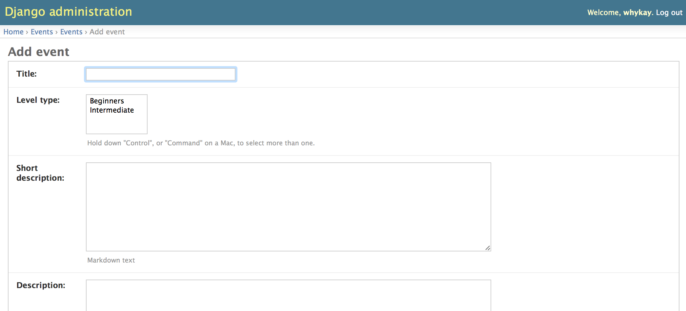

  .. _organisers:

==========
Organisers
==========

Becoming an Organiser
---------------------

* Finds venues, mentors, promotion, catering (optional), co-ordination with mentors, co-organisers, etc.

* Reliably show up to open doors.

* Go-to person on the day.

To be set up as an organiser, email vicky@codinggrace.com.

We will

* add you as an organiser to Coding Grace

* give you access to `codinggrace.com <http://codinggrace.com/>`_ where you can

  * add events
  * post news

* add your chapter to the website

* add you as manager on our `Coding Grace Facebook Page <https://www.facebook.com/pages/Coding-Grace/501098363273457>`_

* add you as co-organiser on our `meetup.com <http://www.meetup.com/codinggrace/>`_ page

Choose what kind of workshop you want to run.
---------------------------------------------

Dublin's first workshop was introduction to Python as it was easy for me to find mentors. If you cannot find mentors, run a workshop you can instruct yourself.

Size of workshop is up to each organiser. Dublin ones are typically capped at 25 attendees, and we aim to have 1 mentor per 5 attendees.

Coding Grace workshop content (slides, exercises, source code, etc.) are shared here: `https://github.com/codinggrace <https://github.com/codinggrace>`_

Please share your workshop content here, READMEs are .md files, so please fill as much information as you can on the content as well as references and resources. If you don't know how, send me a zipped file and I will add to the repository.

Set a date
----------

Setting a date and knowing what workshop you will be running will be enough information when looking for volunteer mentors/helpers and venues.

Call for volunteer mentors
--------------------------

Here are a few suggestions to start looking for volunteer mentors:-

* Universities

* Local companies

* Local usergroups (meetup.com, mailing lists)

* Friends

Find a venue
------------
If it is possible, a city centre location. If that is not possible, try to find a venue that is easily accessible via public transport.

Venue should have at least:

* Tables and chairs (classroom setup)

* Projector (and screen)

* Decent Wi-Fi

Nice to have:

* Use of kitchenette so people can make their own tea/coffee.

Coding Grace can help with initial expenses if funds are available. Email vicky@codinggrace.com

Sponsorship
-----------

* Local companies

* International companies who sponsored past Coding Grace workshop, and you want an introduction, email vicky@codinggrace.com

If you find a sponsor, we will need the following:

* Company Name

* Company Logo (high resolution image)

* Company short description

* Company URL

* What they will be sponsoring

Promo'ing your workshop
-----------------------

* Coding Grace

  * `Mailing List <https://groups.google.com/forum/#!forum/coding-grace>`_

  * `Facebook page <https://www.facebook.com/pages/Coding-Grace/501098363273457>`_

  * `Meetup.com <http://www.meetup.com/codinggrace/>`_

* User group mailing lists

  * Local companies

  * Third level institutions

  * Newspapers and local radio.

* Event sites:

  * `Lanyrd.com <http://lanyrd.com/>`_

  * Silicon Republic's `Events listings <http://www.siliconrepublic.com/events/>`_

  * Your `local Startup Digests <https://www.startupdigest.com/digests>`_

* LinkedIn Groups, some suggestions:

  * Women in Technology and Science Ireland

  * PaddyTech

  * Events Den

Vicky can help:

* Tweet (MT/RT) via `@CodingGrace <https://twitter.com/codinggrace>`_

* `Monthly newsletter <http://us7.campaign-archive1.com/home/?u=8612b25618972d14df5c6a1fb&id=78108add1f>`_, even if you don't have dates or venues, you can still send me details about the workshop you are running so people know what upcoming workshops are happening that month. Please allow at least 2 days notice.

**And finally... by word of mouth! :-)**

Add event to Coding Grace Website
---------------------------------
Organisers can log in to add an event to Coding Grace website:

After you log in, if you have permission, you can add an event. See the following screenshot. 

If you don't have permission, contact `vicky@codinggrace.com <vicky@codinggrace.com>`_.

When you click on the *Add Event* button, you will be brought to the following screen:

You can add the following:

* **Title:** Title of the event
* **Level Type:** Pick one, if you need a new level type, contact `vicky@codinggrace.com <vicky@codinggrace.com>`_.
* **Short description:** About 100 words, what the event/workshop is about, pre-reqs. (`Markdown <http://daringfireball.net/projects/markdown/>`_ supported)
* **Description:** Full description of the event/workshop. (`Markdown <http://daringfireball.net/projects/markdown/>`_ supported)
* (Optional) **FAQ:** Additional info for attendees. Sample entry for the FAQ::

      ### This is a question for the FAQ.
      Some answer to the question for the FAQ.
* **Start datetime:** 
* **End datetime:**
* **Location:** Add location, click on magnifying glass to add a location.

  .. image:: website-04.png

  If it doesn't exist, you can add a new location by clicking on **Add Location** button.

  .. image:: website-05.png

  It will bring up the following:

  .. image:: website-06.png

* **Organiser:** Choose the organiser of the workshop, the main contact person by clicking on the magnifying glass.

  .. image:: website-07.png

  It will bring up the following:

  .. image:: website-08.png

* **Mentors:** Select Mentor(s) for the workshop. If a new mentor needs to be added, just click on the **green +**.

  .. image:: website-09.png

  When you add a new mentor, you get the following screen:

  .. image:: website-10.png

  Either pick **Username** OR **First name/Last name/Blurb/URL**.

* (Optional) **Sponsorship:**  Pick your sponsorship(s). If a new sponsorship is needed, just click on the **green +**.

  .. image:: website-11.png

  When you add a new sponsorship, you get the following screen:

  .. image:: website-12.png

  If the sponsor doesn't exists, click on the **green +** and you get the following screen to add a new sponsor.

  .. image:: website-13.png

* **Cost:** How much the workshop will be? FREE workshops, just enter: **0.00**.

* (Optional) **Embed ticket:** Your EventBrite/GetInvitedTo/Tito embed ticket HTML code.

* **Event URL:** Link to EventBrite/GetInvitedTo/Tito ticket page.

* **Slug:** The slug for this event, this is auto-generated, but you can edit it manually.

* **Is Cancelled** Check this box if an event is not going ahead.

* **Is Published** Check this box if you want the event page to appear to the public and listed in the events.

.. seealso::
	
	* Check out the "Advice for Organisers" at http://pystar.org/.

	* Useful stuff like checklists and other ideas on what to do.

  	  * `Rails Girls Guides <http://guides.railsgirls.com/>`_

